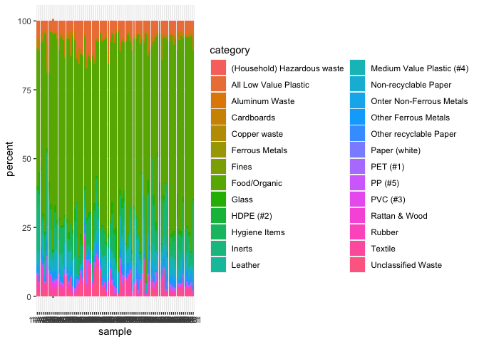
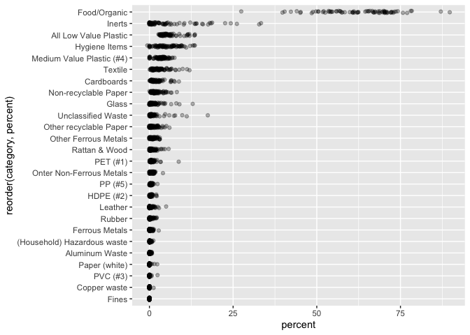

Data resources
================

-   [Introduction](#introduction)
-   [Waste Management](#waste-management)
    -   [Abidjan, Cote d’Ivoire, waste characterization data, Feb-Mar
        2018](#abidjan-cote-divoire-waste-characterization-data-feb-mar-2018)
        -   [Exploration](#exploration)
        -   [Summary tables](#summary-tables)
        -   [Data visualisation](#data-visualisation)
-   [References](#references)

``` r
library(tidyverse)
```

# Introduction

This repo contains explorations of data that is published openly. Topics
include: Waste Management, Air Quality, Wastewater Management, Faecal
Sludge Management, WASH (Water, Sanitation, and Hygiene).

For now, all exploration is done in a single R Markdown script rendered
to this README file. As the document grows, it will be split into sets
of scripts per topic.

# Waste Management

## Abidjan, Cote d’Ivoire, waste characterization data, Feb-Mar 2018

Source: (Innovations 2020)

Results of municipal solid waste characterization study conducted in
Abidjan, Cote d’Ivoire, in February-March, 2018 by [Waste2Worth
Innovations](https://www.w2wglobal.com/).

``` r
dat <- read_csv("data/raw/Abidjan, Cote d'Ivoire, waste characterization data, Feb-Mar 2018.csv") %>% 
  janitor::clean_names() %>% 
  group_by(sample) %>% 
  mutate(
    percent = mass_kg / sum(mass_kg) * 100
  )
```

### Exploration

-   2080 observations
-   8 days of data collection
-   80 samples with measurements in 26 waste categories each

``` r
dat %>% 
  count(date)
```

    ## # A tibble: 80 × 3
    ## # Groups:   sample [80]
    ##    sample date      n
    ##    <chr>  <chr> <int>
    ##  1 1-A1   1-Mar    26
    ##  2 1-A2   1-Mar    26
    ##  3 1-A3   1-Mar    26
    ##  4 1-A4   1-Mar    26
    ##  5 1-A5   1-Mar    26
    ##  6 1-B1   1-Mar    26
    ##  7 1-B2   1-Mar    26
    ##  8 1-B3   1-Mar    26
    ##  9 1-B4   1-Mar    26
    ## 10 1-B5   1-Mar    26
    ## # … with 70 more rows

``` r
dat %>% 
  count(sample)
```

    ## # A tibble: 80 × 2
    ## # Groups:   sample [80]
    ##    sample     n
    ##    <chr>  <int>
    ##  1 1-A1      26
    ##  2 1-A2      26
    ##  3 1-A3      26
    ##  4 1-A4      26
    ##  5 1-A5      26
    ##  6 1-B1      26
    ##  7 1-B2      26
    ##  8 1-B3      26
    ##  9 1-B4      26
    ## 10 1-B5      26
    ## # … with 70 more rows

``` r
dat %>% 
  count(date, sample)
```

    ## # A tibble: 80 × 3
    ## # Groups:   sample [80]
    ##    sample date      n
    ##    <chr>  <chr> <int>
    ##  1 1-A1   1-Mar    26
    ##  2 1-A2   1-Mar    26
    ##  3 1-A3   1-Mar    26
    ##  4 1-A4   1-Mar    26
    ##  5 1-A5   1-Mar    26
    ##  6 1-B1   1-Mar    26
    ##  7 1-B2   1-Mar    26
    ##  8 1-B3   1-Mar    26
    ##  9 1-B4   1-Mar    26
    ## 10 1-B5   1-Mar    26
    ## # … with 70 more rows

``` r
dat %>% 
  count(category) 
```

    ## # A tibble: 2,080 × 3
    ## # Groups:   sample [80]
    ##    sample category                        n
    ##    <chr>  <chr>                       <int>
    ##  1 1-A1   (Household) Hazardous waste     1
    ##  2 1-A1   All Low Value Plastic           1
    ##  3 1-A1   Aluminum Waste                  1
    ##  4 1-A1   Cardboards                      1
    ##  5 1-A1   Copper waste                    1
    ##  6 1-A1   Ferrous Metals                  1
    ##  7 1-A1   Fines                           1
    ##  8 1-A1   Food/Organic                    1
    ##  9 1-A1   Glass                           1
    ## 10 1-A1   HDPE (#2)                       1
    ## # … with 2,070 more rows

``` r
dat %>% 
  arrange(sample)
```

    ## # A tibble: 2,080 × 5
    ## # Groups:   sample [80]
    ##    date  sample category                  mass_kg percent
    ##    <chr> <chr>  <chr>                       <dbl>   <dbl>
    ##  1 1-Mar 1-A1   Food/Organic                36.6   49.8  
    ##  2 1-Mar 1-A1   Paper (white)                0      0    
    ##  3 1-Mar 1-A1   Other recyclable Paper       0.4    0.545
    ##  4 1-Mar 1-A1   Non-recyclable Paper         0.72   0.981
    ##  5 1-Mar 1-A1   Cardboards                   2.92   3.98 
    ##  6 1-Mar 1-A1   Textile                      3.83   5.22 
    ##  7 1-Mar 1-A1   All Low Value Plastic        4.29   5.84 
    ##  8 1-Mar 1-A1   Medium Value Plastic (#4)    2.46   3.35 
    ##  9 1-Mar 1-A1   PP (#5)                      0.55   0.749
    ## 10 1-Mar 1-A1   PET (#1)                     0.32   0.436
    ## # … with 2,070 more rows

### Summary tables

``` r
dat %>% 
  group_by(sample) %>% 
  summarise(
    sum_mass_kg = sum(mass_kg)
  ) %>% 
  arrange(desc(sum_mass_kg)) 
```

    ## # A tibble: 80 × 2
    ##    sample sum_mass_kg
    ##    <chr>        <dbl>
    ##  1 24-B2         166 
    ##  2 24-B1         166.
    ##  3 23-A3         135.
    ##  4 23-B5         134.
    ##  5 23-B2         128.
    ##  6 23-B4         127.
    ##  7 23-B3         126.
    ##  8 26-B5X        126.
    ##  9 3-A2          123.
    ## 10 23-B1         119.
    ## # … with 70 more rows

``` r
dat %>% 
  arrange(sample) %>% 
  group_by(category) %>% 
  summarise(
    count = n(),
    mean = mean(percent),
    sd = sd(percent),
    min = min(percent),
    max = max(percent)
  ) %>% 
  arrange(desc(mean)) %>% 
  knitr::kable(digits = 1)
```

| category                    | count | mean |   sd |  min |  max |
|:----------------------------|------:|-----:|-----:|-----:|-----:|
| Food/Organic                |    80 | 62.5 | 11.0 | 27.4 | 89.7 |
| Inerts                      |    80 |  5.8 |  7.8 |  0.0 | 33.3 |
| All Low Value Plastic       |    80 |  5.7 |  2.8 |  2.7 | 13.6 |
| Hygiene Items               |    80 |  5.2 |  3.5 | -0.6 | 13.6 |
| Medium Value Plastic (#4)   |    80 |  3.4 |  1.7 |  0.0 |  7.5 |
| Textile                     |    80 |  3.1 |  2.5 |  0.1 | 12.0 |
| Cardboards                  |    80 |  2.1 |  1.9 |  0.0 |  8.8 |
| Non-recyclable Paper        |    80 |  2.0 |  1.7 |  0.0 |  8.2 |
| Glass                       |    80 |  1.6 |  2.1 |  0.0 | 12.9 |
| Unclassified Waste          |    80 |  1.4 |  2.8 |  0.0 | 17.4 |
| Other recyclable Paper      |    80 |  1.2 |  1.3 |  0.0 |  6.0 |
| Other Ferrous Metals        |    80 |  1.0 |  0.8 |  0.0 |  3.1 |
| Rattan & Wood               |    80 |  0.9 |  1.1 |  0.0 |  5.7 |
| PET (#1)                    |    80 |  0.8 |  1.1 |  0.0 |  8.7 |
| Onter Non-Ferrous Metals    |    80 |  0.8 |  0.6 |  0.0 |  4.0 |
| PP (#5)                     |    80 |  0.4 |  0.4 |  0.0 |  2.4 |
| HDPE (#2)                   |    80 |  0.4 |  0.4 |  0.0 |  2.2 |
| Leather                     |    80 |  0.4 |  0.8 |  0.0 |  5.0 |
| Rubber                      |    80 |  0.4 |  0.5 |  0.0 |  2.2 |
| Ferrous Metals              |    80 |  0.3 |  0.5 |  0.0 |  2.8 |
| (Household) Hazardous waste |    80 |  0.2 |  0.2 |  0.0 |  1.2 |
| Aluminum Waste              |    80 |  0.1 |  0.2 |  0.0 |  0.7 |
| Paper (white)               |    80 |  0.1 |  0.3 |  0.0 |  2.3 |
| PVC (#3)                    |    80 |  0.1 |  0.3 |  0.0 |  2.4 |
| Copper waste                |    80 |  0.0 |  0.1 |  0.0 |  1.3 |
| Fines                       |    80 |  0.0 |  0.0 |  0.0 |  0.1 |

### Data visualisation

``` r
dat %>% 
  ggplot(aes(x = sample, y = percent, fill = category)) +
  geom_col()
```

<!-- -->

``` r
dat %>% 
  ggplot(aes(x = reorder(category, percent), y = percent)) +
  coord_flip() +
  geom_jitter(width = 0.1, alpha = 0.3)
```

<!-- -->

# References

<div id="refs" class="references csl-bib-body hanging-indent">

<div id="ref-innovations2020abidjan" class="csl-entry">

Innovations, Waste2Worth. 2020. “Abidjan, Cote d’Ivoire, Waste
Characterization Data, Feb-Mar 2018.” Zenodo.
<https://doi.org/10.5281/zenodo.4012765>.

</div>

</div>
